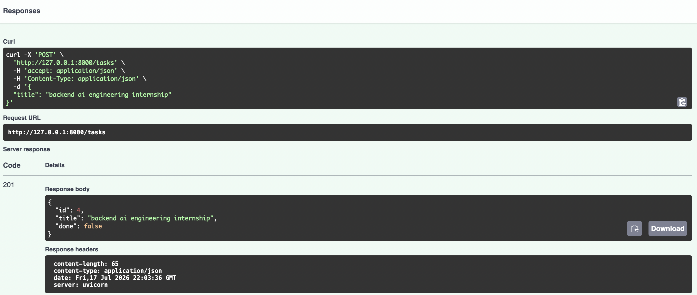
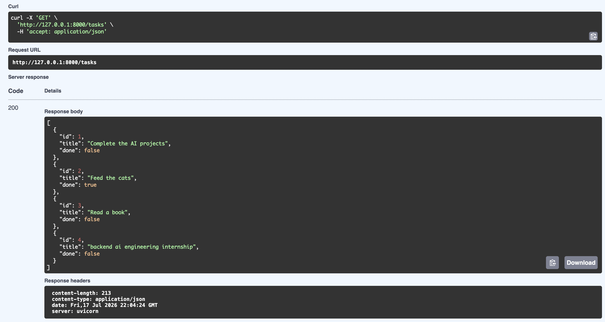
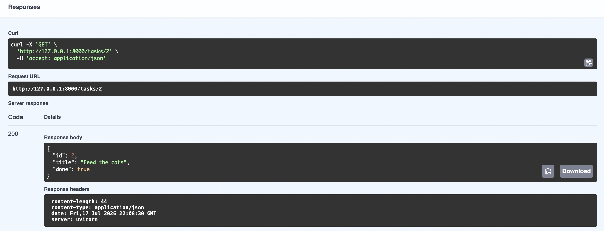
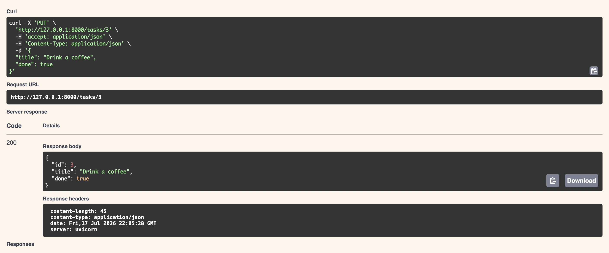
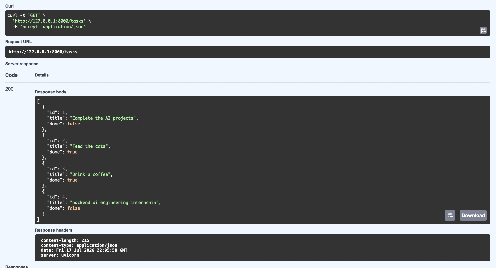
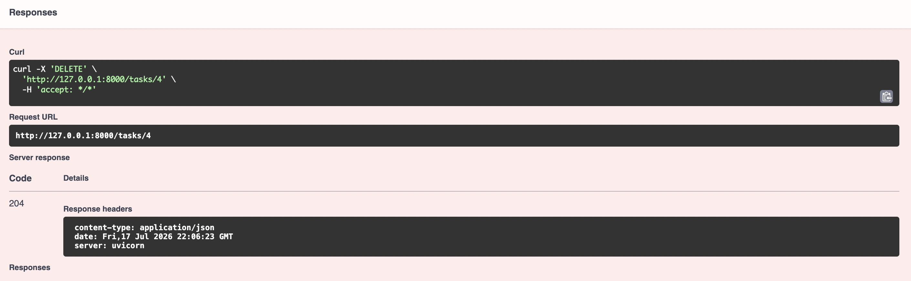
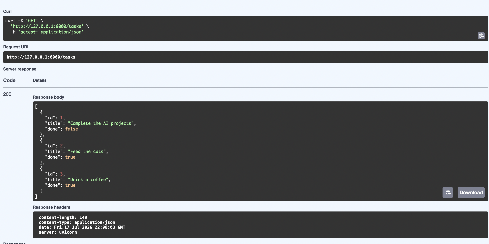

# Simple CRUD API with FastAPI

This project is a Task Management API that performs basic CRUD (Create, Read, Update, Delete) operations.


## Installation and Running

Ensure you have Python installed, then follow these steps:

1. Install the required dependencies:
   ```bash
   pip install fastapi uvicorn
   ````

2. Start the server :
   ```bash
   uvicorn main:app --reload
   ````

## API Endpoints

| Method | Endpoint | Description |
| :--- | :--- | :--- |
| POST | /tasks | Create a new task |
| GET | /tasks | List all tasks |
| PUT | /tasks/{id} | Update an existing task |
| DELETE | /tasks/{id} | Delete a task |


## Swagger UI
Access the interactive API documentation at: ```http://127.0.0.1:8000/docs```


## Example curl Output (GET)

```bash
curl -X GET [http://127.0.0.1:8000/tasks](http://127.0.0.1:8000/tasks)
```

**JSON**
```bash
[
  {"id": 1, "title": "Complete the AI projects", "done": false},
  {"id": 2, "title": "Feed the cats", "done": true}
]
```


## API Documentation and Testing

Here are the verification screenshots for the CRUD operations performed via Swagger UI:

### 1. Create a Task (POST)


### 2. Read Tasks (GET)




### 3. Update a Task (PUT)




### 4. Delete a Task (DELETE)





---
## About the Developer
**Tuğba Çağla EREN** - Backend AI Engineering Intern at FlyRank AI
- [LinkedIn Profile](https://www.linkedin.com/in/cagla-eren/)
- Passionate about Data Science, Machine Learning, and RAG architectures.