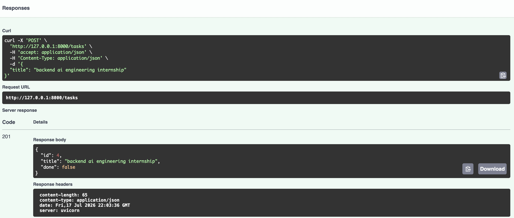
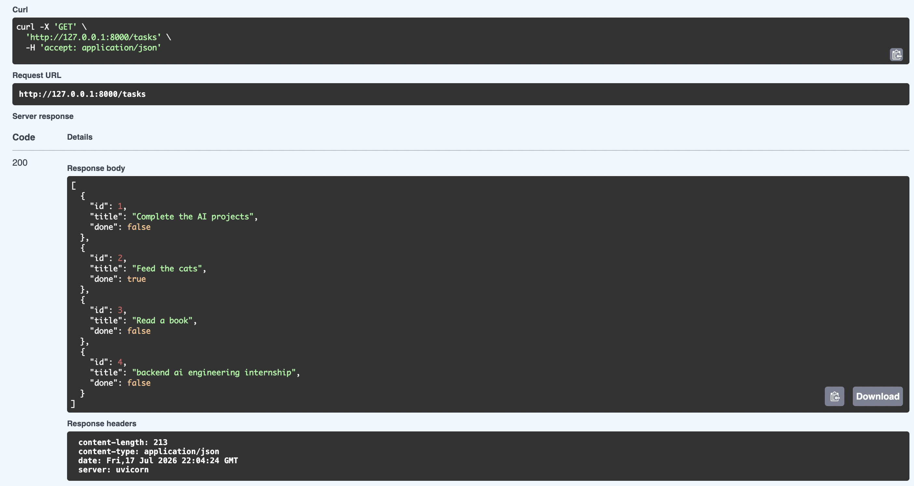
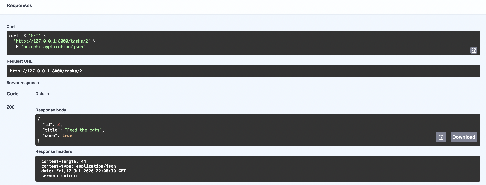
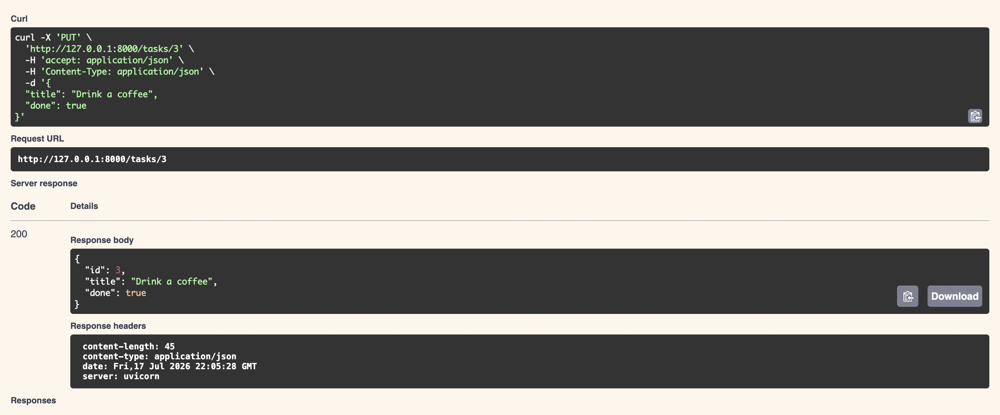
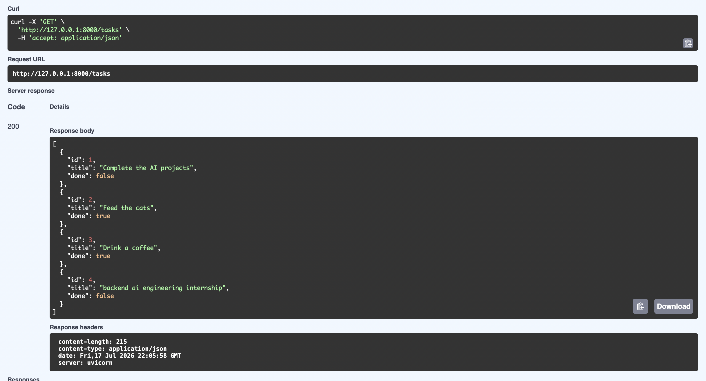
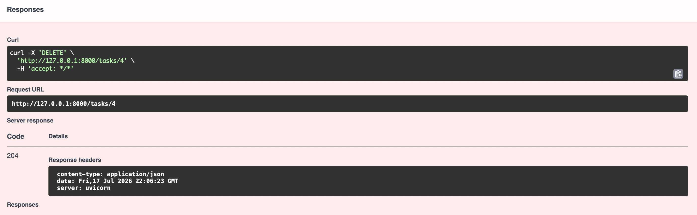
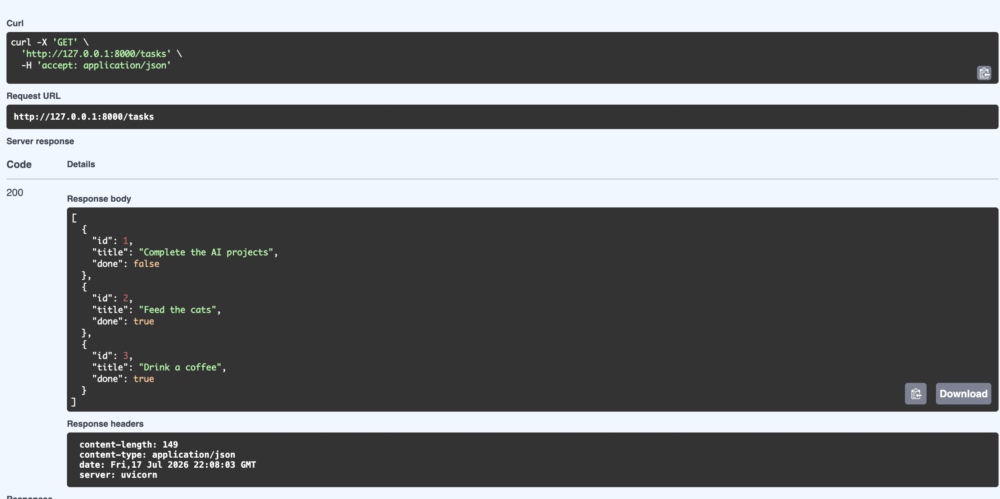
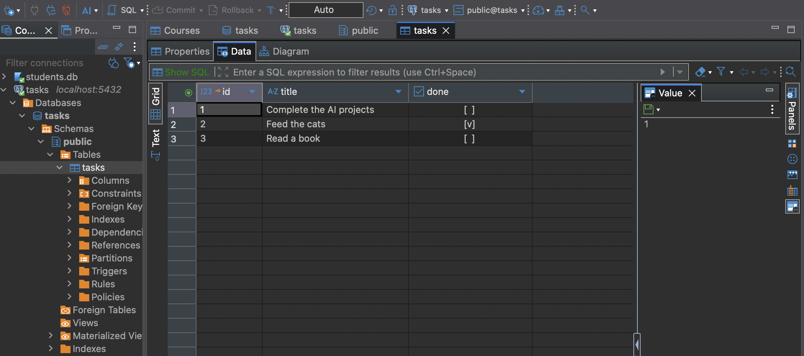

# Simple CRUD API with FastAPI & PostgreSQL

This project is a Task Management API that performs basic CRUD (Create, Read, Update, Delete) operations, fully containerized with Docker Compose.

## 🚀 Quick Start (One-Command Run)

To run this project locally, ensure you have **Docker** and **Docker Compose** installed on your machine.

1. **Clone the repository:**
   ```bash
   git clone <your-repo-url>
   cd my_crud_api
   ```

2. **Set up the environment variables:**
   ```bash
   cp .env.example .env
   ```

3. **Run everything with a single command:**
   ```bash
   docker compose up --build
   ```

The API will be available at http://localhost:3000, and the PostgreSQL database will automatically initialize.

## 🛠️ Environment Variables
| Variable | Description | Example |
| :--- | :--- | :--- |
| DATABASE_URL | PostgreSQL connection string pointing to the docker service | postgres://postgres:dev@db:5432/tasks |


## API Endpoints

| Method | Endpoint | Description |
| :--- | :--- | :--- |
| POST | /tasks | Create a new task |
| GET | /tasks | List all tasks |
| PUT | /tasks/{id} | Update an existing task |
| DELETE | /tasks/{id} | Delete a task |


## Swagger UI
Access the interactive API documentation at: `http://localhost:3000/docs`


## Example curl Output (GET)

```bash
curl -i http://localhost:3000/tasks
```

**JSON**
```bash
[
  {"id": 1, "title": "Complete the AI projects", "done": false},
  {"id": 2, "title": "Feed the cats", "done": true}
]
```


## API Documentation and Testing

Here are the verification screenshots for the CRUD operations performed via Swagger UI:

### 1. Create a Task (POST)


### 2. Read Tasks (GET)




### 3. Update a Task (PUT)




### 4. Delete a Task (DELETE)





## Database Configuration (PostgreSQL & Docker)

- **Why PostgreSQL was chosen:** PostgreSQL is a powerful, enterprise-class open-source relational database system that provides robust concurrency, reliability, and seamless containerization support via Docker.
- **How data persistence works:** The database state is securely stored using a Docker volume (`taskdata`), ensuring data is preserved even when containers are stopped or recreated.
- **Automatic Database Creation:** The project is configured so that someone cloning the repository can run `docker compose up` and automatically set up the database structure without manual intervention.

### Database Viewer Screenshot


### Example SQL Query Executed
```sql
-- Update all tasks to mark them as completed
UPDATE tasks SET done = TRUE;

```

## About the Developer
**Tuğba Çağla EREN** - Backend AI Engineering Intern at FlyRank AI
- [LinkedIn Profile](https://www.linkedin.com/in/cagla-eren/)
- Passionate about Data Science, Machine Learning, and RAG architectures.